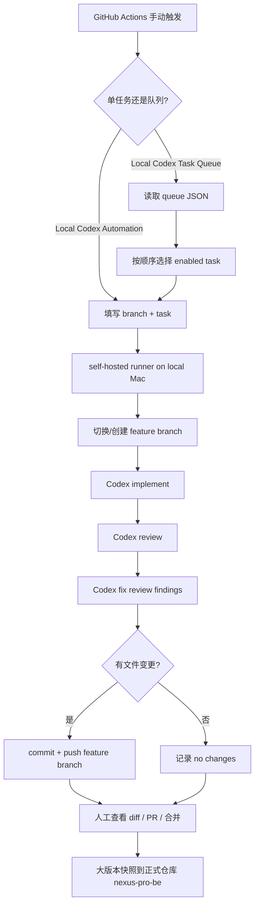
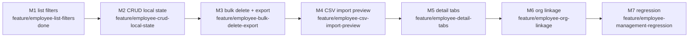

# Local Codex Visual Workflow

## 总流程



## 员工管理队列



## 可视化位置

- GitHub Actions run 页面：实时看当前 job、耗时、成功/失败。
- `Local Codex Task Queue` 的 run summary：显示队列流程图、每个任务的 branch、结果和 commit。
- 本文件：看整体流程和任务依赖。

## 队列运行方式

打开：

```text
https://github.com/zxygzhong-art/nexus-pro-be-coding/actions/workflows/local-codex-queue.yml
```

常用输入：

```text
queue_file: .ai-workflow/queues/employee-management.json
start_from: M2
max_tasks: 1
dry_run: false
```

说明：

- `max_tasks=1`：一次只跑一个模块，推荐日常使用。
- `max_tasks=0`：从 `start_from` 开始一路跑完所有 enabled 任务。
- `dry_run=true`：只显示队列计划，不执行 Codex。
